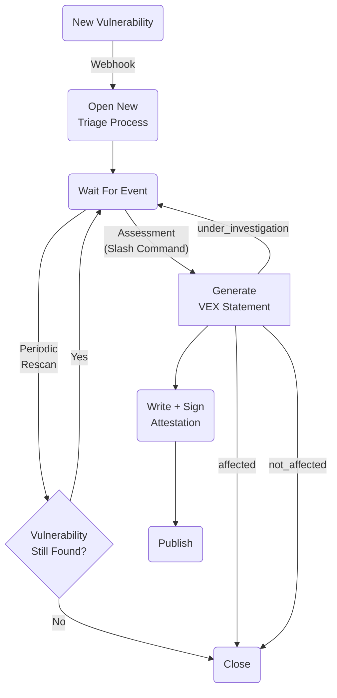

# vexflow

### Manage Vulnerability Impact Information


Vexflow handles the lifecycle of VEX information for projects through GitHub 
issues. It keeps track of vulnerabilities that show up in your dependencies
and manages a triaging process where maintainers assess the vulnerability's
impact on the project and communicate it through signed OpenVEX attestations.

Vexflow generates VEX data in the [OpenVEX](https://github.com/openvex) format
and published the generated documents attested in [In-Toto](https://in-toto.io/)
attestations signed with [Sigstore](https://www.sigstore.dev/).

Note that while vexflow is almost feature complete, is still expermiental. But
please try it and report back any issues you find.

## Triage Process Lifecycle

When new vulnerabilities are discovered in the monitored branches,
vexflow opens a new triage issue. As long as the vulnerability is
present in the branch, the issue remains open waiting for an assessment
from the authorized maintainers.

Using vexflow's chatops interface, maintainers create an assessment using one
of the recognized slash commands:

```
/fixed

/affected

/not_affected:component_not_present
/not_affected:vulnerable_code_not_present
/not_affected:vulnerable_code_not_in_execute_path
/not_affected:vulnerable_code_cannot_be_controlled_by_adversary
/not_affected:inline_mitigations_already_exist
```

After registering an assessment, `vexflow` translates the comment into an
OpenVEX document that is signed and publised to the specified location.

### Triasge Lifecycle Overview



### Triage Repository

By default, vexflow will look for a .vexflow repository in
the same organization of the monitored project. In this 
repository, vexflow will open the triage issues and will 
look for information about the authorized maintainers. The
triage repo can be overwritten using the `--triage-repo` 
flag.

To specify the authorized maintainers, vexflow will look for a 
Kubernetes/Prow-style OWNERS YAML file. Anyone listed  under the 
`approvers` section will be able to assess vulnerabilities 
(and issue VEX documents).

Here is an example of the 
[OWNERS file format](https://www.kubernetes.dev/docs/guide/owners/):

```
approvers:
  - alice
  - bob     # this is a comment
```


## Plugging into Vexflow

The vexflow triage manager is designed to be pluggable, it can support more
security scanners as well as other publishers for the VEX documents it generates.

By default, vexflow uses OSV scanner to find vulnerabilities in your branches.
The code includes a version that shells out to run the osv-binary as an example
of integrating with other tools. If you want to add support for more scanners
simply implement the `api.Scanner` interface and swap the default osv scanner or
add it, we have de-duplication logic so vulnerabilities from multiple scanners
can be returned.

Vex document publishing can be swapped out for another backed by implementing the
`api.VexPublisher` interface. The default publisher signs attested VEX documents
and hosts them in the GitHub attestation store, but other backend could be
added as long as they satisfy the interface.

### License

Vexflow is Copyright by Carabiner Systems, Inc and released under the Apache 2.0
license. If you are using vexflow, please let us know! Also, feel free to file
issues or improve the project by opening a pull request.


